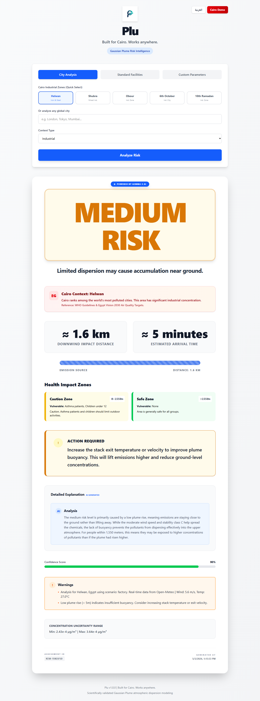

<div align="center">


# Plu

### Predict who will be affected by industrial emissions — before it happens.

[](https://fastapi.tiangolo.com/)
[](https://react.dev/)
[](https://openrouter.ai/)
[](https://open-meteo.com/)
[](LICENSE)

**Plu** is a production-grade industrial emission decision-support tool. It combines the Gaussian Plume atmospheric dispersion model with real-time weather data and an AI explanation engine (Google Gemma 4 via OpenRouter) to assess, visualize, and explain emission risk — for any city in the world.


</div>

---

## 🚨 The Problem
Every year, communities living near Cairo's industrial zones breathe toxic air without knowing the danger. Governments build schools and hospitals in polluted areas. Families with asthma move into danger zones without warning. Existing systems only monitor — they do NOT predict impact zones or warn vulnerable populations before it's too late.

## 💡 The Solution
Plu predicts exactly where industrial pollution will spread, how long before it arrives, and who is most at risk — using 50 years of validated atmospheric physics combined with Gemma 4 AI explanations in Arabic and English.

---

## Screenshots



---

## Features

- **Gaussian Plume Physics** — Scientifically rigorous Briggs plume rise, Pasquill-Gifford dispersion, and ground-reflection concentration model.
- **Real-Time Weather** — Integrates live wind speed and temperature from Open-Meteo for any global city. No API key required.
- **AI Explanations** — Google Gemma 4 (31B) via OpenRouter generates human-readable risk explanations and actionable recommendations for each assessment.
- **Cairo Industrial Zones** — Dedicated quick-select presets for Cairo's major industrial zones (Helwan, Shubra El-Kheima, El-Obour, 6th October, 10th of Ramadan).
- **Bilingual UI (EN / AR)** — Full English/Arabic language toggle with RTL layout support.
- **Health Zone Analysis** — Zone-based health impact assessment with vulnerable population guidance.
- **Confidence Scoring** — Model confidence quantification based on atmospheric stability and wind conditions.
- **Advanced Metrics** — Impact width, time-to-impact, peak distance, uncertainty range, and population risk.
- **Robust Fallback** — If AI is unavailable, a deterministic rule-based engine generates physics-grounded explanations so the system never crashes.

---

## Why Cairo?

Cairo ranks among the world's most air-polluted cities. Communities living near industrial zones in Helwan and Shubra El-Kheima face daily exposure to emission risk with no accessible tools to understand the danger. Plu was built to change that.

*Note: While Plu includes specialized presets for Cairo, the physics engine and live weather integration work globally for any city in the world.*

---

## Tech Stack

| Layer | Technology |
|---|---|
| Backend API | FastAPI · Python 3.12 · Uvicorn |
| Physics Engine | Pure Python (NumPy) — No external modeling libraries |
| AI Layer | Google Gemma 4 31B via OpenRouter |
| Weather Data | Open-Meteo (Forecast + Geocoding) — No key required |
| Frontend | React 18 · TypeScript · Vite |
| Styling | Tailwind CSS |

---

## Scientific Foundation

Plu implements the **Gaussian Plume Dispersion Model** — the industry-standard approach used in environmental consulting and regulatory compliance.

### 1. Plume Rise (Briggs Formula)

```
Fb = (g × ve × d² × (Ts − Ta)) / (4 × Ts)
Δh = Fb / u
H  = h_stack + Δh
```

### 2. Dispersion Coefficients (Pasquill-Gifford, Classes A–F)

```
σy = α × x / (1 + 0.0001x)
σz = class-specific empirical formulas
```

### 3. Ground-Level Concentration

```
C(x, y, z) = Q / (2π u σy σz)
           × exp(−y² / 2σy²)
           × [exp(−(z−H)² / 2σz²) + exp(−(z+H)² / 2σz²)]
```

### 4. Risk Decision Matrix

| Risk Level | Trigger Condition |
|---|---|
| **HIGH** | Concentration ≥ 0.001 g/m³ **OR** Impact Distance > 2,000 m |
| **MEDIUM** | Concentration ≥ 0.0001 g/m³ **OR** Impact Distance > 800 m |
| **LOW** | Concentration < 0.0001 g/m³ **AND** Impact Distance ≤ 800 m |

---

## Architecture

```
┌──────────────────────────────────────────────────────────────┐
│                     React Frontend (Vite)                    │
│        InputSection · ResultCard · MetricsGrid · Map         │
└───────────────────────────┬──────────────────────────────────┘
                            │ HTTP (localhost:5173 → 8000)
┌───────────────────────────▼──────────────────────────────────┐
│                      FastAPI Backend                          │
│   /predict-egypt  ·  /predict  ·  /simulate-impact  ·  /     │
└──────────┬─────────────────────────────────┬─────────────────┘
           │                                 │
┌──────────▼──────────┐           ┌──────────▼──────────┐
│   Physics Engine    │           │   AI Explanation     │
│  plume_rise.py      │           │  gemma_explainer.py  │
│  dispersion.py      │           │  → OpenRouter        │
│  concentration.py   │           │  → Gemma 4 31B       │
│  impact_distance.py │           │  → Fallback Engine   │
└─────────────────────┘           └─────────────────────┘
           │
┌──────────▼──────────┐           ┌──────────────────────┐
│  Decision Engine    │           │  Weather Service     │
│  risk_engine.py     │           │  egypt_weather.py    │
│  health_zones.py    │           │  → Open-Meteo API    │
│  confidence.py      │           │  → Geocoding API     │
└─────────────────────┘           └──────────────────────┘
```

---

## Quick Start

### 1. Clone and Install

```bash
git clone https://github.com/Youssef1Essam/plu.git
cd plu
pip install -r requirements.txt
```

### 2. Configure Environment

Create a `.env` file in the project root:

```env
# AI Configuration (Required for AI explanations)
USE_AI_EXPLANATIONS=true
OPENROUTER_API_KEY=your_openrouter_api_key_here
OPENROUTER_MODEL=google/gemma-4-31b-it
```

> Get a free OpenRouter API key at [openrouter.ai](https://openrouter.ai).
> Weather data uses Open-Meteo — **no API key required**.

### 3. Start Backend

```bash
python main.py
# API available at http://localhost:8000
# Docs at http://localhost:8000/docs
```

### 4. Start Frontend

```bash
cd emission-risk-ui
npm install
npm run dev
# UI available at http://localhost:5173
```

---

## API Reference

### `POST /predict-egypt`

Primary endpoint. Fetches live weather for the specified city, runs the full Gaussian Plume calculation, and returns a risk assessment with an AI-generated explanation.

**Request:**
```json
{
  "city_name": "Helwan",
  "emission_rate": 50.0,
  "stack_height": 30.0,
  "exit_velocity": 8.0,
  "stack_diameter": 1.5,
  "stack_temperature": 350.0,
  "ambient_temperature": 293.0,
  "stability_class": "F",
  "location_type": "industrial"
}
```

**Response:**
```json
{
  "risk_level": "HIGH",
  "peak_concentration": 0.001693,
  "impact_distance_meters": 5000,
  "effective_height": 35.9,
  "explanation": "The HIGH risk classification is driven by a very stable atmosphere (Class F) and low wind speed of 1.5 m/s, which severely limits vertical mixing and horizontal dispersion...",
  "recommendation": "Implement immediate emission reduction protocols. Issue local health advisory for areas within the impact radius.",
  "confidence": 0.82,
  "assessment_id": "RISK-A1B2C3D4",
  "timestamp": "2026-05-02T21:00:00"
}
```

### `POST /predict`

Lower-level endpoint. Accepts manual wind speed and ambient temperature instead of fetching live weather.

### `GET /`

Health check. Returns service name, version, and status.

---

## Project Structure

```
modeling-factors/
├── app/
│   ├── decision/
│   │   └── risk_engine.py          # Risk level classification + explanation generation
│   ├── models/
│   │   ├── request.py              # Pydantic input models
│   │   └── response.py             # Pydantic output models
│   ├── physics/
│   │   ├── plume_rise.py           # Buoyancy flux, Briggs plume rise
│   │   ├── dispersion_coeffs.py    # Pasquill-Gifford σy, σz
│   │   ├── concentration.py        # Gaussian plume formula
│   │   └── impact_distance.py      # Downwind impact simulation
│   ├── routers/
│   │   ├── predict_egypt.py        # /predict-egypt endpoint
│   │   └── predict.py              # /predict endpoint
│   ├── services/
│   │   └── risk_assessment_service.py  # Pipeline orchestration
│   └── utils/
│       ├── gemma_explainer.py      # AI explanation layer (OpenRouter / Gemma 4)
│       ├── egypt_weather.py        # Open-Meteo weather + geocoding
│       ├── health_zones.py         # Health zone risk mapping
│       ├── confidence.py           # Confidence scoring
│       ├── warnings.py             # Physics-based warning generation
│       └── advanced_metrics.py     # Impact width, time-to-impact, uncertainty
├── emission-risk-ui/               # React + TypeScript frontend
│   └── src/
│       ├── App.tsx                 # Root component + language state
│       └── components/
│           ├── InputSection.tsx    # City selection + parameter form
│           ├── ResultCard.tsx      # Risk result display
│           ├── MetricsGrid.tsx     # Advanced metrics panel
│           ├── RecommendationBox.tsx
│           └── ExplanationSection.tsx
├── main.py                         # FastAPI app entry point
├── requirements.txt
└── .env                            # API keys and config
```

---

## Model Limitations

Plu is a decision-support tool, not a regulatory-grade dispersion model. Known limitations:

- Assumes steady-state conditions (no time variation)
- Assumes flat terrain (no topography or building downwash)
- Models a single point source
- Does not account for chemical reactions, wet/dry deposition, or photolysis

> For regulatory compliance modeling, use **EPA AERMOD** or **CALPUFF**.

---

## References

- Tawfik, B.S. (2005). *Modeling of the Factors Affecting the 
  Distribution of Chimney Emissions to the Atmosphere — 
  Case Study: Shobra El-Kheima Power Plant (SEPP)*.
  ResearchGate.

- Turner, D.B. (1994). *Workbook of Atmospheric Dispersion 
  Estimates*, 2nd Ed.

- Pasquill, F. (1961). *The Estimation of the Dispersion of 
  Windborne Material*. The Meteorological Magazine.

- Briggs, G.A. (1969). *Plume Rise*. 
  U.S. Atomic Energy Commission.

---

<div align="center">

**Built with scientific integrity. Designed for real decisions.**

*Plu — Atmospheric Emission Monitor*

</div>
